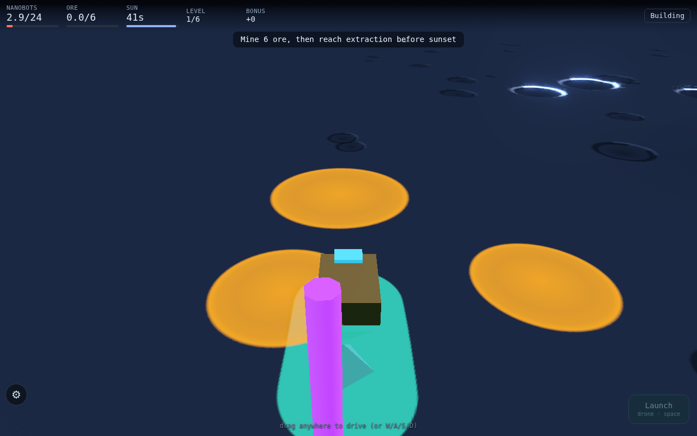
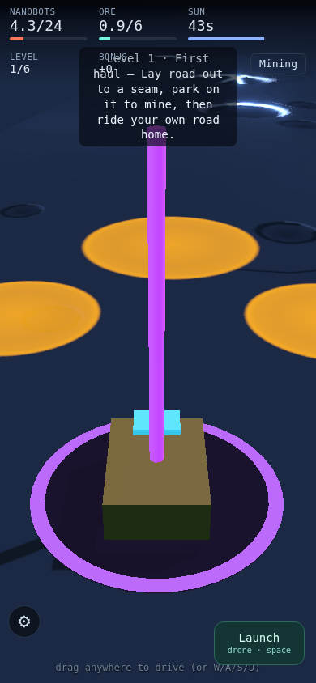

# State Audit — 2026-09-24 (checkpoint `bef3b58`)

Scope: steps 1–3 of the evaluation plan (read-only), then steps 4–5 (doc rewrites and archive moves) once the owner approved them. See "Applied" near the end. No source, config or test file was changed.

Previous audit: `RECONCILIATION.md` (Linear DEV-49, checkpoint `f870f0c`, PR #27). This audit covers PRs #28–#40.

Linear: DEV-54 (this audit). Findings routed there; see "Routing" below.

---

## 1. Code baseline

Checkpoint: `main` at `bef3b58` (Merge PR #40), 2026-09-24.
Environment: Linux container, Node v22.22.2, Chromium build 1194 at `/opt/pw-browsers` (Playwright 1.61 expects 1228, so browser scripts need `CHROME_PATH=/opt/pw-browsers/chromium-1194/chrome-linux/chrome`).

| Check | Result | Evidence |
|---|---|---|
| `npm ci` | exit 0 | — |
| `npm test` | **pass**, 189 tests, 18 files | vitest 4.1.11, 4.5 s |
| `npm run build` | **pass**, one 673.53 kB chunk (gzip 178.6 kB), under the 1600 kB limit | `vite.config.ts` |
| `npm audit` | **pass**, 0 vulnerabilities | PR #29 fixed the moderate advisory |
| `npm run smoke:continuous` | **pass** with `CHROME_PATH` set: "SMOKE OK — booted clean, HUD up, rover drove 46 units." Without it: fails on the missing Playwright build 1228 (environment, not code) | — |
| `npm run report:last-light` | **pass**, 5/5 routes won, Crawl Seconds 0.0 on every route | DEV-51 still true (see §3) |
| `npm run play:through` | **FAIL** — `page.waitForFunction` timeout at `scripts/playthrough.mjs:158` | New finding F1 |
| GitHub CI on `main` | green on every merge from #37 to #40 (CI + Pages) | Actions runs 172–178 |

**F1 (DEV-55) — `play:through` is dead since the Phaser retirement.** `scripts/playthrough.mjs` (last touched 2026-09-08) waits for `#moon-miner-continuous-debug-state`, and calls `window.__moonMinerContinuous.startSelfPlay()` / `getLoopSummary()` and the `moon-miner-carried-road-v1` / `moon-miner-continuous-arena-v1` storage keys. The Three.js build exposes none of these: it exposes `window.__mm3d = { getState, road, keys }` (`src/three/bootstrap.ts:1418`) and uses `mm3d-*` keys. CI doesn't run this script, so nothing caught it. The only full-run, real-input harness in the repo doesn't work.

Test coverage by layer: `src/game/**` (pure sim) and the ported `src/three/` logic modules (road, loop, rail, junction, carry, sun, craters, stick, sliderCurve) have unit tests. `src/three/bootstrap.ts` (1,422 lines: renderer, input, HUD, drone, eraser) and `src/three/panel.ts` are covered only by the one-drive smoke test.

## 2. The game as played

Method: `docs/audit/2026-09-24/session.mjs`. It starts Vite, opens a fresh browser context for desktop (1280×800, keyboard) and phone (390×844, touch drag), drives for about 12 s, presses Space once on desktop, records `__mm3d.getState()` and HUD text, and takes screenshots.

What the build is today:

- **Campaign of levels.** HUD reads `LEVEL 1/6`, `NANOBOTS 4.0/24`, `ORE 0.0/6`, `SUN 43s`, `BONUS +0`, and a mode chip (`Building` / `Mining`). Level 1 intro: "First haul — Lay road out to a seam, park on it to mine, then ride your own road home." Then the objective reads "Mine 6 ore, then reach extraction before sunset."
- **Controls.** W/A/S/D or drag-anywhere virtual stick; Space or the `Launch` button launches the drone. R (or tapping the banner) only advances after a level ends (`onContinue` returns early while playing, `bootstrap.ts:1113`). A ⚙ panel holds the tuning knobs.
- **Drone.** On desktop, one Space press 1 s into the drive produced "Drone reclaiming 104 of road…", so the eraser drone reclaims road just laid behind the rover.
- **Console.** No page errors on either viewport. One warning: `THREE.WebGLShadowMap: PCFSoftShadowMap has been removed. Using PCFShadowMap instead.` The renderer asks for a shadow type that three 0.186 no longer provides.

 

Findings:

- **F2 (DEV-56) — phone HUD overlap.** At 390×844 the level-intro card covers the `LEVEL` and `BONUS` readouts (see `phone-boot.png`). The smoke test's HUD-overlap check was a Phaser-era feature (README) and no longer exists (DEV-53).
- **F3 (DEV-57) — deprecated shadow map constant.** The renderer requests `PCFSoftShadowMap`, which three 0.186 no longer has. Three falls back to `PCFShadowMap` with only a console warning, so the soft shadows tuned in PRs #31/#32 aren't what renders.
- **Observation, low confidence.** The phone run started in `Mining` with ore accruing before any input; the desktop run started in `Building`. Each fresh context gets a random game seed (`src/three/loop.ts:304`), so this is probably a seed whose spawn sits inside a seam. Not reproduced; worth a seeded check.
- **Limit of this pass.** Headless SwiftShader advanced the sim about 3 s per 12 s of wall time, so a full level (43 s of sun) was not played to an end state here. F1 is the reason no scripted full-run check exists to fill that gap.

## 3. Doc claims inventory

16 root markdown files, 5,163 lines. Nine were last edited 2026-07-01; none has been touched since PR #28 (2026-09-23). PRs #29–#40 changed levels, controls, drone, rail model, junctions, day arc and panel, and no doc records any of it.

### Claims checked against `bef3b58`

| # | Claim | Where | Verdict | Evidence |
|---|---|---|---|---|
| C1 | "134 tests in 13 files" | PROGRESS:8, :24; RECONCILIATION:16 | **stale** | 189 tests, 18 files |
| C2 | "62 tests" proof paragraph | README:54, START_HERE:244 | **stale** (already flagged in banner) | as above |
| C3 | "Audit: **red**" | PROGRESS:11, :30 | **stale** | 0 vulnerabilities since PR #29 |
| C4 | Build "634.74 kB chunk" | PROGRESS:25 | stale (minor) | 673.53 kB |
| C5 | URL flags `?mobile=1`, `?debug=1`, `?view=chase` | README Run Locally, START_HERE | **false**, banner-flagged | DEV-52 open |
| C6 | Controls: click/tap steering target, `Esc`, `R` resets, "Drone" button, flat tactical view, bottom drive pad | README Controls | **false** | §2: WASD / drag-anywhere stick, Space/`Launch`, R only continues after a level, chase-style 3D camera |
| C7 | `#moon-miner-continuous-debug-state` snapshot; smoke drives A/D/W/S/Space, checks tactical/chase, HUD overlap, portrait mobile pass | README Proof Checks | **false** | smoke checks boot, HUD, one drive via `__mm3d` (DEV-53) |
| C8 | Dev-only Dynamics panel, `~` toggle | README | **stale** | replaced by the ⚙ panel (PRs #26, #37, #39) |
| C9 | `src/main.ts`, `src/scenes/*.ts` | DECISIONS, HANDOFF, RECONCILIATION | historical (files deleted in PR #10) | acceptable in dated records; wrong in HANDOFF §1+ as orientation |
| C10 | `/Users/prodadmin/Documents/Moon Miner` | START_HERE (4), HUMAN_OPERATING_SYSTEM (1) | **false** off one machine | DEV-8 open |
| C11 | `npm run play:through` is a working harness | DECISIONS 2026-09-08 | **false** | F1 |
| C12 | Known Issues: "prototype vector lines", no mute control, "first map teaches reclaim" | BUGS | **stale** | vector rail rendering retired (HANDOFF §0); first map is now Level 1 of 6 (PR #40) |
| C13 | `--experimental-websocket` flag vestigial | Linear DEV-11 | still true | `package.json:11` |
| C14 | Last-light notes ignore crawl metric | Linear DEV-51 | still true | notes say "crawl pressure" / "heavy crawl" while Crawl Seconds = 0.0 on all 5 routes |
| C15 | Core loop: continuous steering, just-in-time field, drone reclaim, emergency crawl, sunset quota | GAME_DESIGN | **matches in outline** | §2; "emergency crawl" never shows in the report (C14) |
| C16 | DECISIONS is the durable decision trail | README, HANDOFF | **gap** | last entry 2026-09-15 ("Road Rework"); PRs #11–#40 (30 merges) have no DECISIONS entry in the repo |

### Per-file classification

| File | Lines | Class | Current state | Proposed action (not taken) |
|---|---|---|---|---|
| README.md | 81 | canonical-now | Run/Controls/Proof sections describe Phaser build | Rewrite Run, Controls, Proof for the 3D build; keep Project Memory index |
| START_HERE.md | 321 | canonical-now | machine paths, dead flags, 62-test claim | Fix paths (DEV-8) and flags (DEV-52); swap the count for a pointer to CI |
| PROGRESS.md | 218 | canonical-now | "Current Reality"/"Last Verified" out of date (C1, C3, C4) | Refresh from §1 of this audit |
| BUGS.md | 39 | canonical-now | Known Issues describe the retired renderer | Replace with F1–F3 and open Linear bugs; archive the Phaser-era resolved entry |
| HANDOFF.md | 315 | canonical-now (§0) + historical (§1+) | §0 current as of PR #27; §1+ Phaser | Extend §0 with PRs #28–#40; move §1+ to `docs/archive/` with a pointer (ECO-28A) |
| RECONCILIATION.md | 115 | dated record | accurate for `f870f0c` | Keep; add a pointer to this audit |
| DECISIONS.md | 1,883 | decision record (append-only) | ends 2026-09-15 | Keep; add entries (or a pointer to PR bodies) for #11–#40 (links to DEV-50) |
| GAME_DESIGN.md | 59 | design canon | holds in outline; no mention of levels, eraser drone, junctions | Keep; review against build under DEV-13 |
| CONCEPT_REFRAME.md | 95 | design canon | 2026-07-01 | Keep; DEV-13 |
| BETS.md | 260 | decision record | 2026-07-01, cites `?mobile=1` | Keep as dated; archive if bets are closed |
| PLAYTESTING.md / PLAYTEST_PROMPT.md | 442 / 163 | method | method holds; not engine-specific | Keep |
| ROUND_1_PLAYTEST.md | 329 | historical (V0 grid) | self-described "paused" | Move to `docs/archive/` |
| SCAFFOLDING_STANDARD.md | 583 | method | engine-agnostic | Keep |
| HUMAN_OPERATING_SYSTEM.md | 235 | method | one machine path | Fix path (DEV-8) |
| PRIOR_ART.md | 25 | reference | fine | Keep |

## Routing

Existing Linear tickets confirmed still open against `bef3b58`: DEV-8, DEV-11, DEV-51, DEV-52, DEV-53, DEV-7, DEV-13, DEV-50 (now needs to cover PRs #28–#40 too).
Tickets whose premise PRs #38/#39 may have changed (drone eraser, aim-to-erase): DEV-14 (drone timing decision), DEV-20 (drone lift topology). Recheck before working them.

New tickets for new findings, children of DEV-54 in the Moon Miner project:

- DEV-55: F1, `play:through` targets Phaser-era hooks (High).
- DEV-56: F2, phone HUD overlap, plus the spawn-in-seam observation (Medium).
- DEV-57: F3, `PCFSoftShadowMap` removed in three 0.186 (Low).
- DEV-58: doc drift since PR #28 (C1–C4, C6–C8, C12, C16) (High).

## Applied 2026-09-24 (steps 4–5, DEV-58, owner-approved)

| File | Action taken |
|---|---|
| README.md | Removed the status banner. Rewrote Run, Controls and Proof Checks for the 3D build. Added the live-build link. Updated the Project Memory index. |
| START_HERE.md | Replaced machine paths with a clone-relative path (DEV-8). Replaced URL Modes with "One URL, No Modes" and a Controls section (DEV-52). Replaced the hand-kept check list with pointers to CI and PROGRESS. |
| PROGRESS.md | New Current Reality, Last Verified (this audit's run) and Known Red. The 2026-09-23 record is kept as superseded. Pre-3D sections flagged for DEV-7. |
| BUGS.md | Known Issues replaced with F1–F3 and open Linear bugs, each ticketed. Pre-3D resolved entry moved to `docs/archive/BUGS_resolved_pre-3d.md`. |
| HANDOFF.md | Rewritten for the current build: substrate, cold start, controls, doctrine (hook updated to `__mm3d`), architecture map, proof state, open work. Old file moved to `docs/archive/HANDOFF_2026-09-16.md` with an archive banner. |
| DECISIONS.md | Appended an index of PRs #10–#40 with merge hashes, plus the four decisions that change what older entries say. |
| RECONCILIATION.md | Added a pointer to this audit. Body unchanged. |
| HUMAN_OPERATING_SYSTEM.md | Machine path replaced (DEV-8). |
| ROUND_1_PLAYTEST.md | Moved to `docs/archive/` with a banner. |
| GAME_DESIGN, CONCEPT_REFRAME, BETS, PLAYTESTING, PLAYTEST_PROMPT, SCAFFOLDING_STANDARD, PRIOR_ART | Unchanged, as proposed. Design-canon reconciliation stays with DEV-13. |

No source, config or test file changed. Nothing was deleted.

## Not done in this pass

- Any code fix (DEV-55, DEV-56, DEV-57, DEV-51, DEV-11).
- PROGRESS sections from "Last Good Commit" down (DEV-7) and the design-canon review (DEV-13).
- A full level played to its end state (see §2 limit).
- ECB patch: proposal 34a3a8cd (`moon_miner_road_rework_decisions`) from DEV-49 is still unapplied in ECB; this audit does not touch it.
